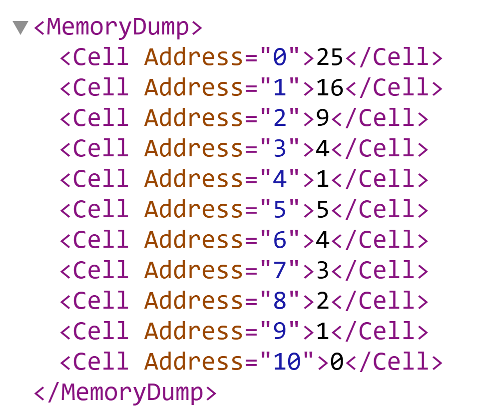

## Описание

Данный проект реализует ассемблер и интерпретатор для учебной виртуальной машины (УВМ). Цель программы — предоставить возможность компиляции простых команд в бинарный формат, их интерпретации и выполнения, включая тестовую задачу по вычислению квадратных корней для элементов вектора.

## Структура проекта

- `uvm.py` — основной файл с реализацией ассемблера и интерпретатора.
- `source.txt` — файл с исходным кодом на языке ассемблера для УВМ.
- `program.bin` — бинарный файл, скомпилированный из исходного кода.
- `log.txt` — файл журнала с описанием каждой собранной команды.
- `result.xml` — файл с результатами выполнения интерпретатора.

## Использование

### 1. Подготовка исходного кода
Создайте файл `source.txt` с командами. Пример содержания файла:
```
LOAD 0 25
LOAD 1 16
LOAD 2 9
LOAD 3 4
LOAD 4 1
SQRT 0 5
SQRT 1 6
SQRT 2 7
SQRT 3 8
SQRT 4 9
```

### 2. Запуск программы

#### Требования:
- Python версии 3.8 или выше.
- Установленный модуль `math` (входит в стандартную библиотеку Python).

#### Запуск:
Сохраните проект и выполните следующую команду в терминале:
```bash
python main.py
```

### 3. Результаты выполнения
После успешного выполнения программы будут созданы следующие файлы:
- **`program.bin`**: бинарный файл скомпилированной программы.
- **`log.txt`**: файл с логами компиляции, содержащий команды в читаемом формате.
- **`result.xml`**: файл с результатами выполнения программы в формате XML. Пример:
  ```xml
  <MemoryDump>
      <Cell Address="0">0</Cell>
      <Cell Address="5">5</Cell>
      <Cell Address="6">4</Cell>
      <Cell Address="7">3</Cell>
      <Cell Address="8">2</Cell>
      <Cell Address="9">1</Cell>
  </MemoryDump>
  ```

## Команды УВМ

- **LOAD**: загрузка константы в память.
  - Пример: `LOAD 42 558` (загрузить 558 в адрес 42).
- **READ**: чтение значения из памяти.
  - Пример: `READ 4 50` (считать значение из адреса 4 в адрес 50).
- **WRITE**: запись значения в память.
  - Пример: `WRITE 99 20` (записать значение из адреса 99 в адрес 20).
- **SQRT**: вычисление квадратного корня.
  - Пример: `SQRT 476 38` (вычислить корень значения в адресе 476 и записать в адрес 38).

# Результаты
Результаты будут сохранены в файле `result.xml`. Пример приведён на изображении ниже:


